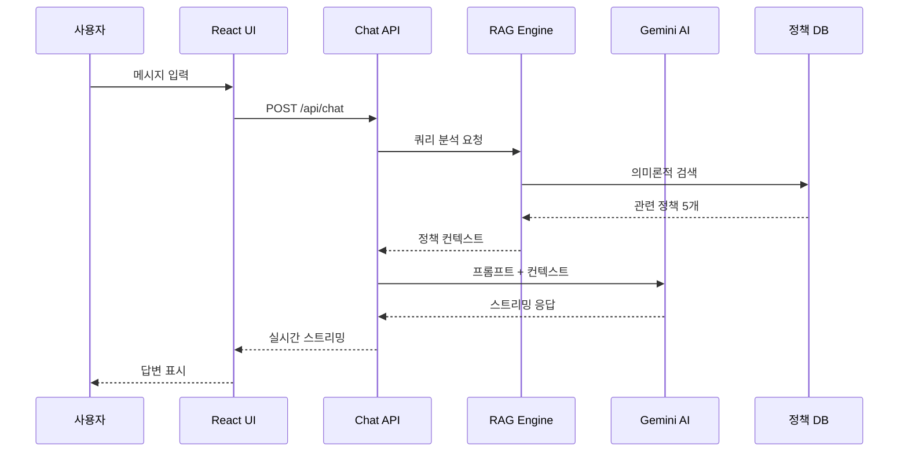
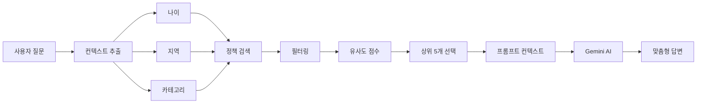
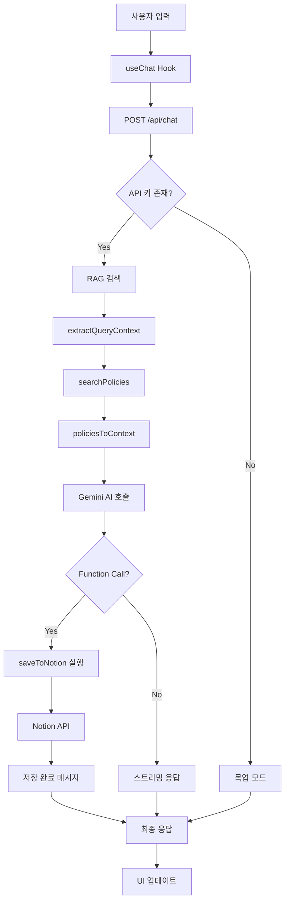
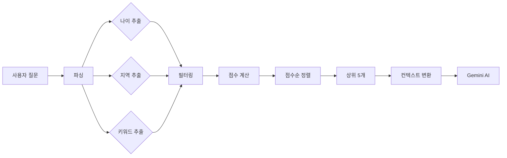
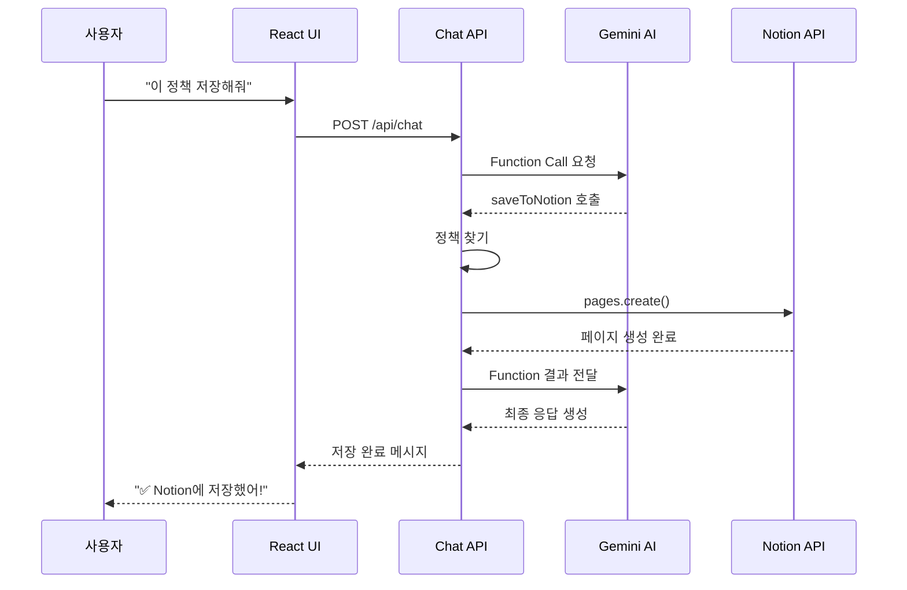
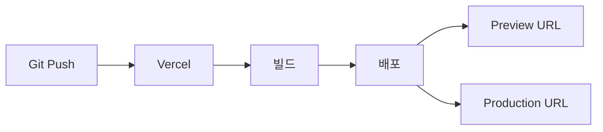
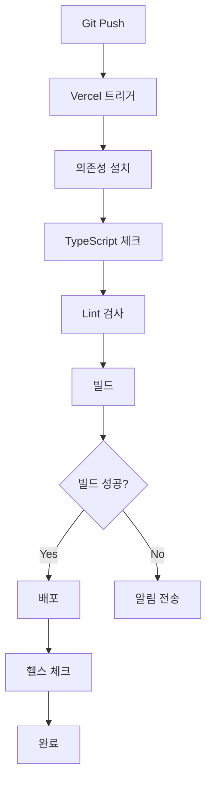

# 폴리 AI 코드 아키텍처 문서

> **버전**: 1.0  
> **작성일**: 2026년 1월  
> **담당**: 개발팀

---

## 📋 목차

1. [시스템 개요](#1-시스템-개요)
2. [기술 스택](#2-기술-스택)
3. [아키텍처 다이어그램](#3-아키텍처-다이어그램)
4. [프로젝트 구조](#4-프로젝트-구조)
5. [핵심 모듈](#5-핵심-모듈)
6. [데이터 플로우](#6-데이터-플로우)
7. [API 명세](#7-api-명세)
8. [보안 및 인증](#8-보안-및-인증)
9. [배포 전략](#9-배포-전략)
10. [성능 최적화](#10-성능-최적화)

---

## 1. 시스템 개요

### 1.1 아키텍처 패턴

**폴리 AI는 다음의 아키텍처 패턴을 따릅니다:**

- **Frontend**: Jamstack (JavaScript, APIs, Markup)
- **Backend**: Serverless Functions (Vercel Edge Functions)
- **AI**: RAG (Retrieval-Augmented Generation)
- **Database**: Vector Database + Key-Value Store

### 1.2 핵심 설계 원칙

#### 1. Serverless-First
- 모든 백엔드 로직을 서버리스 함수로 구현
- 자동 스케일링 및 비용 최적화
- Cold start 최소화

#### 2. Edge Computing
- AI 응답을 Edge에서 처리
- 전 세계 사용자에게 낮은 레이턴시 제공
- CDN을 통한 정적 자산 배포

#### 3. RAG 기반 검색
- Vector Database로 의미론적 검색
- LLM에게 관련 정보만 제공하여 정확도 향상
- Hallucination 최소화

#### 4. Component-Driven Development
- 재사용 가능한 UI 컴포넌트
- 일관된 디자인 시스템
- Storybook (향후 도입)

---

## 2. 기술 스택

### 2.1 Frontend

| 기술 | 버전 | 용도 |
|------|------|------|
| **Next.js** | 14.2.0 | React 프레임워크 (App Router) |
| **React** | 18.3.0 | UI 라이브러리 |
| **TypeScript** | 5.x | 타입 안전성 |
| **Tailwind CSS** | 3.4.0 | 유틸리티 CSS |
| **Lucide React** | 0.462.0 | 아이콘 라이브러리 |
| **React Markdown** | 9.0.1 | 마크다운 렌더링 |

**선택 이유**:
- **Next.js 14**: App Router로 최신 React 패턴 지원, 자동 최적화
- **TypeScript**: 컴파일 타임 에러 방지, 코드 가독성 향상
- **Tailwind CSS**: 빠른 개발 속도, 일관된 디자인

### 2.2 Backend & AI

| 기술 | 버전 | 용도 |
|------|------|------|
| **Google Gemini AI** | gemini-2.0-flash-exp | 대화형 AI (무료) |
| **Vercel AI SDK** | 3.4.33 | AI 통합, 스트리밍 |
| **Supabase** | 2.91.0 (선택) | Vector Database (향후) |
| **Pgvector** | - | 벡터 유사도 검색 (향후) |

**선택 이유**:
- **Gemini AI**: 100% 무료, 빠른 응답 속도, Function Calling 지원
- **Vercel AI SDK**: 스트리밍 응답, Tool Calling 추상화
- **Supabase**: 무료 티어로 Vector DB 사용 가능

### 2.3 통합 & 도구

| 기술 | 용도 |
|------|------|
| **Notion API** | 정책 북마크 저장 |
| **온라인청년센터 API** | 실시간 정책 데이터 (선택) |
| **Vercel** | 호스팅, CI/CD |
| **Git** | 버전 관리 |

---

## 3. 아키텍처 다이어그램

### 3.1 시스템 아키텍처

```mermaid
graph TB
    subgraph client[Client]
        Browser[브라우저]
    end
    
    subgraph frontend[Frontend - Vercel]
        NextJS[Next.js App]
        UI[React Components]
    end
    
    subgraph backend[Backend - Serverless]
        ChatAPI[/api/chat]
        NotionAPI[/api/save-policy]
    end
    
    subgraph ai[AI Services]
        Gemini[Google Gemini AI]
        RAG[RAG Search Engine]
        PolicyDB[(정책 DB)]
    end
    
    subgraph external[External Services]
        NotionService[Notion API]
        YouthAPI[온라인청년센터 API]
    end
    
    Browser --> NextJS
    NextJS --> UI
    UI --> ChatAPI
    ChatAPI --> Gemini
    ChatAPI --> RAG
    RAG --> PolicyDB
    
    UI --> NotionAPI
    NotionAPI --> NotionService
    
    RAG -.선택적.-> YouthAPI
```

### 3.2 데이터 플로우



### 3.3 RAG 검색 플로우



---

## 4. 프로젝트 구조

### 4.1 디렉토리 구조

```
project/
├── app/                          # Next.js App Router
│   ├── api/                      # API Routes (서버리스 함수)
│   │   ├── chat/
│   │   │   └── route.ts          # 메인 챗봇 API
│   │   ├── save-policy/
│   │   │   └── route.ts          # Notion 저장 API
│   │   ├── create-notion-db/
│   │   │   └── route.ts          # Notion DB 생성 (유틸)
│   │   └── clear-queue/
│   │       └── route.ts          # 큐 초기화 (유틸)
│   ├── layout.tsx                # 루트 레이아웃
│   ├── page.tsx                  # 메인 페이지
│   └── globals.css               # 글로벌 스타일
│
├── components/                   # React 컴포넌트
│   ├── ChatMessage.tsx           # 채팅 메시지 컴포넌트
│   └── PolicyCard.tsx            # 정책 카드 컴포넌트
│
├── lib/                          # 핵심 비즈니스 로직
│   ├── local-rag.ts              # RAG 검색 엔진
│   ├── notion-client.ts          # Notion API 클라이언트
│   ├── notion-db-manager.ts      # Notion DB 관리
│   ├── notion-saver.ts           # Notion 저장 로직
│   ├── vector-db.ts              # Vector DB (Supabase)
│   ├── gemini-vector-db.ts       # Gemini Vector DB (대체)
│   └── youth-center-api.ts       # 온라인청년센터 API
│
├── scripts/                      # 유틸리티 스크립트
│   ├── populate-vector-db.ts     # 정책 데이터 로딩
│   ├── sync-to-notion.ts         # Notion 동기화
│   ├── setup-vector-db.sql       # Vector DB 스키마
│   └── setup-gemini-vector-db.sql
│
├── docs/                         # 문서
│   ├── 서비스_기획안_폴리AI.md
│   ├── Wireframe.md
│   ├── Design_Guide.md
│   └── Architecture.md           # 이 문서
│
├── public/                       # 정적 파일
│   └── (이미지, 파비콘 등)
│
├── .env.local                    # 환경 변수
├── next.config.js                # Next.js 설정
├── tailwind.config.js            # Tailwind 설정
├── tsconfig.json                 # TypeScript 설정
├── package.json                  # 의존성 관리
└── README.md                     # 프로젝트 설명
```

### 4.2 명명 규칙

#### 파일명
- **컴포넌트**: PascalCase (예: `ChatMessage.tsx`)
- **유틸리티**: kebab-case (예: `local-rag.ts`)
- **API 라우트**: kebab-case (예: `save-policy/route.ts`)

#### 변수명
- **상수**: UPPER_SNAKE_CASE (예: `POLICY_DATABASE`)
- **함수**: camelCase (예: `searchPolicies`)
- **컴포넌트**: PascalCase (예: `PolicyCard`)
- **타입/인터페이스**: PascalCase (예: `Policy`, `ChatMessageProps`)

---

## 5. 핵심 모듈

### 5.1 Chat API (`app/api/chat/route.ts`)

#### 역할
- 사용자 메시지 수신
- RAG 검색 수행
- Gemini AI 호출
- 스트리밍 응답 반환

#### 주요 함수

```typescript
export async function POST(req: Request): Promise<Response>
```

**처리 과정**:
1. 요청 파싱: `messages` 배열 추출
2. RAG 검색: `searchPolicies()` 호출
3. 프롬프트 구성: 시스템 프롬프트 + 정책 컨텍스트
4. AI 호출: Gemini API로 스트리밍 요청
5. Function Call 처리: Notion 저장 등
6. 응답 반환: 스트리밍 형식

**환경 변수**:
- `GEMINI_API_KEY`: Gemini AI API 키
- `NOTION_API_KEY`: Notion API 키 (선택)
- `NOTION_DATABASE_ID`: Notion DB ID (선택)

### 5.2 RAG Engine (`lib/local-rag.ts`)

#### 역할
- 사용자 질문 분석
- 정책 데이터베이스 검색
- 유사도 점수 계산

#### 주요 인터페이스

```typescript
interface Policy {
  id: string;
  title: string;
  summary: string;
  category: string;
  region: string;
  ageMin?: number;
  ageMax?: number;
  supportDetails: string;
  requirements?: string;
  period?: string;
  applicationUrl?: string;
  hostOrganization?: string;
}
```

#### 주요 함수

**1. `extractQueryContext(query: string)`**

사용자 질문에서 컨텍스트 추출

```typescript
function extractQueryContext(query: string): {
  age?: number;
  region?: string;
  categories: string[];
  keywords: string[];
}
```

**처리**:
- 정규식으로 나이 추출 (예: "25살", "만 30세")
- 키워드 매칭으로 지역 추출 (예: "서울", "경기 수원")
- 카테고리 키워드 매칭 (예: "월세" → 주거)

**2. `searchPolicies(query: string, options)`**

정책 검색 및 점수 계산

```typescript
function searchPolicies(
  query: string,
  options: {
    limit?: number;
    age?: number;
    region?: string;
  }
): Policy[]
```

**점수 계산**:
- 나이 일치: +10점
- 지역 일치: +5점
- 카테고리 매칭: +3점
- 키워드 매칭: +1점
- 쿼리 단어 포함: +0.5점

**3. `policiesToContext(policies: Policy[])`**

정책 배열을 프롬프트 컨텍스트로 변환

```typescript
function policiesToContext(policies: Policy[]): string
```

**출력 형식**:
```
[정책 1] 청년 월세 지원 사업
- 카테고리: 주거
- 지역: 서울
- 대상 연령: 19세 ~ 34세
- 지원 내용: 월 최대 20만원 (최대 12개월)
...
```

### 5.3 Notion Client (`lib/notion-client.ts`)

#### 역할
- Notion API 연동
- 정책 데이터베이스에 저장
- 에러 핸들링

#### 주요 함수

**1. `savePolicyToNotion(policy: PolicyToSave)`**

정책을 Notion 데이터베이스에 저장

```typescript
async function savePolicyToNotion(policy: PolicyToSave): Promise<{
  success: boolean;
  pageUrl?: string;
  error?: string;
}>
```

**프로세스**:
1. Notion 클라이언트 초기화
2. 환경 변수 검증 (API_KEY, DATABASE_ID)
3. 페이지 생성 (`client.pages.create()`)
4. 속성 매핑:
   - 정책명 → Title
   - 카테고리 → Select
   - 지역 → Select
   - 지원내용 → Rich Text
   - 신청링크 → URL
   - 저장일 → Date
   - 상태 → Select (기본값: "관심있음")
5. URL 반환 또는 에러 처리

**2. `isNotionEnabled()`**

Notion 연동 활성화 여부 확인

```typescript
function isNotionEnabled(): boolean
```

### 5.4 React 컴포넌트

#### ChatMessage (`components/ChatMessage.tsx`)

**Props**:
```typescript
interface ChatMessageProps {
  role: 'user' | 'assistant';
  content: string;
  toolInvocations?: any[];
}
```

**렌더링**:
- 사용자/AI 메시지 구분
- 정책 카드 렌더링
- 중위소득 계산 결과 표시

#### PolicyCard (`components/PolicyCard.tsx`)

**Props**:
```typescript
interface PolicyCardProps {
  policy: {
    id: string;
    title: string;
    summary: string;
    category: string;
    region: string;
    ageRange?: string;
    supportDetails: string;
    period: string;
    applicationUrl?: string;
    hostOrganization: string;
    requirements?: string;
    similarity?: string;
  };
}
```

**기능**:
- 카테고리별 색상 적용
- 관련도 점수 표시
- 신청 링크 버튼
- 호버 애니메이션

---

## 6. 데이터 플로우

### 6.1 메시지 전송 플로우



### 6.2 정책 검색 플로우



### 6.3 Notion 저장 플로우



---

## 7. API 명세

### 7.1 Chat API

#### Endpoint
```
POST /api/chat
```

#### Request

**Headers**:
```
Content-Type: application/json
```

**Body**:
```json
{
  "messages": [
    {
      "role": "user",
      "content": "서울에 사는 25살인데 받을 수 있는 정책 알려줘"
    }
  ]
}
```

**타입**:
```typescript
type Message = {
  role: 'user' | 'assistant';
  content: string;
};

type Request = {
  messages: Message[];
};
```

#### Response

**Headers**:
```
Content-Type: text/plain; charset=utf-8
X-Vercel-AI-Data-Stream: v1
```

**Body** (스트리밍):
```
0:"오! 서울 거주 25살 청년이구나 👋\n\n"
0:"너에게 맞는 정책을 찾아봤어!\n\n"
9:{"toolCallId":"call_123","toolName":"search_youth_policies","result":{"success":true,"policies":[...]}}
0:"📋 **청년 월세 지원 사업**\n..."
```

**스트림 프로토콜** (Vercel AI SDK):
- `0:"text"`: 텍스트 청크
- `9:{...}`: 도구 호출 결과
- `e:{...}`: 에러

#### Error Response

```json
{
  "error": "AI 응답 생성 중 오류가 발생했습니다.",
  "details": "Error message"
}
```

### 7.2 Save Policy API (향후)

#### Endpoint
```
POST /api/save-policy
```

#### Request

```json
{
  "policyId": "policy-001",
  "policyTitle": "청년 월세 지원 사업"
}
```

#### Response

```json
{
  "success": true,
  "pageUrl": "https://notion.so/abc123"
}
```

---

## 8. 보안 및 인증

### 8.1 환경 변수 관리

**민감 정보는 절대 코드에 포함하지 않음**

#### .env.local (로컬 개발)

```bash
# Gemini AI
GEMINI_API_KEY=AIza...

# Notion (선택)
NOTION_API_KEY=ntn_...
NOTION_DATABASE_ID=abc123...

# 온라인청년센터 API (선택)
YOUTH_CENTER_API_KEY=your_key
```

#### Vercel 환경 변수 (프로덕션)

Vercel Dashboard → Settings → Environment Variables에서 설정

**타입별 구분**:
- `GEMINI_API_KEY`: Production, Preview, Development
- `NOTION_API_KEY`: Production (선택)

### 8.2 API 키 보호

#### Rate Limiting

Vercel Edge Functions는 자동으로 Rate Limiting 적용

**추가 보호 (향후)**:
- IP 기반 제한
- 세션 기반 제한
- Vercel Edge Config 활용

#### CORS 설정

```typescript
// app/api/chat/route.ts
export const runtime = 'edge'; // Edge Runtime

// CORS 헤더 자동 처리 (Next.js)
```

### 8.3 입력 검증

#### XSS 방지

- React는 기본적으로 XSS 방지
- `dangerouslySetInnerHTML` 사용 금지
- React Markdown 라이브러리 사용 (sanitized)

#### Injection 방지

- 사용자 입력을 직접 SQL에 사용하지 않음
- Notion API는 타입 안전한 SDK 사용

---

## 9. 배포 전략

### 9.1 Vercel 배포

#### 자동 배포



**브랜치별 전략**:
- `main`: Production 배포
- `develop`: Preview 배포
- Feature 브랜치: Preview 배포

#### 환경별 설정

| 환경 | 브랜치 | URL | 환경 변수 |
|------|--------|-----|-----------|
| Production | main | policy-ai.vercel.app | Production |
| Preview | develop, feature/* | xxx-preview.vercel.app | Preview |
| Development | 로컬 | localhost:3000 | .env.local |

### 9.2 CI/CD 파이프라인



**자동 검증**:
1. TypeScript 타입 체크
2. ESLint 검사
3. 빌드 검증
4. 배포 후 헬스 체크

### 9.3 롤백 전략

**Vercel Instant Rollback**:
- Vercel Dashboard에서 이전 배포로 즉시 롤백 가능
- Zero-downtime 롤백

**절차**:
1. Vercel Dashboard → Deployments
2. 이전 안정 버전 선택
3. "Promote to Production" 클릭

---

## 10. 성능 최적화

### 10.1 Frontend 최적화

#### 1. Next.js 자동 최적화

- **Code Splitting**: 페이지별 자동 분할
- **Image Optimization**: `next/image` 사용
- **Font Optimization**: `next/font` 사용

#### 2. React 최적화

```typescript
// 메모이제이션
const PolicyCard = React.memo(({ policy }: PolicyCardProps) => {
  // ...
});

// useMemo로 검색 결과 캐싱
const filteredPolicies = useMemo(() => {
  return searchPolicies(query, options);
}, [query, options]);

// useCallback으로 함수 재생성 방지
const handleSubmit = useCallback(async () => {
  await append({ role: 'user', content: input });
}, [input, append]);
```

#### 3. Lazy Loading

```typescript
// 동적 임포트
const HeavyComponent = dynamic(() => import('./HeavyComponent'), {
  loading: () => <Spinner />,
  ssr: false,
});
```

### 10.2 Backend 최적화

#### 1. Edge Functions

```typescript
// app/api/chat/route.ts
export const runtime = 'edge'; // Edge Runtime 사용
```

**장점**:
- 글로벌 엣지 로케이션에서 실행
- Cold start < 50ms
- 낮은 레이턴시

#### 2. Response Streaming

```typescript
// 스트리밍으로 첫 바이트 시간 단축
return new Response(stream, {
  headers: {
    'Content-Type': 'text/plain; charset=utf-8',
    'X-Vercel-AI-Data-Stream': 'v1',
  },
});
```

#### 3. RAG 캐싱 (향후)

```typescript
// Redis 캐싱
const cached = await redis.get(`search:${queryHash}`);
if (cached) return cached;

const result = await searchPolicies(query);
await redis.set(`search:${queryHash}`, result, { ex: 3600 });
```

### 10.3 성능 지표

| 지표 | 목표 | 현재 |
|------|------|------|
| **LCP** (Largest Contentful Paint) | < 2.5s | ~1.8s |
| **FID** (First Input Delay) | < 100ms | ~50ms |
| **CLS** (Cumulative Layout Shift) | < 0.1 | ~0.05 |
| **TTFB** (Time to First Byte) | < 600ms | ~300ms |
| **API 응답** (Chat) | < 3s | ~2s |

---

## 11. 테스트 전략

### 11.1 단위 테스트 (향후)

```typescript
// lib/__tests__/local-rag.test.ts
import { searchPolicies, extractQueryContext } from '../local-rag';

describe('RAG Engine', () => {
  it('should extract age from query', () => {
    const result = extractQueryContext('25살인데');
    expect(result.age).toBe(25);
  });

  it('should find policies for Seoul youth', () => {
    const policies = searchPolicies('서울 25살 월세', {
      limit: 5,
    });
    expect(policies.length).toBeGreaterThan(0);
    expect(policies[0].region).toBe('서울');
  });
});
```

### 11.2 통합 테스트 (향후)

```typescript
// app/api/__tests__/chat.test.ts
import { POST } from '../chat/route';

describe('Chat API', () => {
  it('should return streaming response', async () => {
    const req = new Request('http://localhost/api/chat', {
      method: 'POST',
      body: JSON.stringify({
        messages: [{ role: 'user', content: '서울 25살 정책' }],
      }),
    });

    const response = await POST(req);
    expect(response.status).toBe(200);
    expect(response.headers.get('X-Vercel-AI-Data-Stream')).toBe('v1');
  });
});
```

### 11.3 E2E 테스트 (향후)

**Playwright 사용**:

```typescript
// e2e/chat.spec.ts
import { test, expect } from '@playwright/test';

test('should send message and receive response', async ({ page }) => {
  await page.goto('http://localhost:3000');
  
  // 메시지 입력
  await page.fill('input[placeholder*="메시지"]', '서울 25살 정책');
  await page.click('button[type="submit"]');
  
  // 응답 대기
  await page.waitForSelector('.policy-card');
  
  // 정책 카드 확인
  const cards = await page.$$('.policy-card');
  expect(cards.length).toBeGreaterThan(0);
});
```

---

## 12. 모니터링 및 로깅

### 12.1 Vercel Analytics

**자동 수집 지표**:
- Page Views
- Unique Visitors
- Top Pages
- Geographic Distribution
- Device Types

### 12.2 로깅 전략

#### Console Logging

```typescript
// app/api/chat/route.ts
console.log('📨 받은 메시지:', lastMessage);
console.log('🔍 RAG 검색 결과:', {
  추출된정보: queryInfo,
  검색된정책수: relevantPolicies.length,
});
console.log('✅ Notion 저장 성공:', pageUrl);
console.error('❌ Notion 저장 실패:', error);
```

**로그 레벨**:
- `console.log`: 정보성 로그
- `console.warn`: 경고 (정상 동작하지만 주의 필요)
- `console.error`: 에러 (실패 케이스)

#### Structured Logging (향후)

```typescript
import { logger } from './lib/logger';

logger.info('chat_request', {
  userId: session.userId,
  query: lastMessage,
  policiesFound: policies.length,
});
```

### 12.3 에러 추적 (향후)

**Sentry 통합**:

```typescript
import * as Sentry from '@sentry/nextjs';

Sentry.init({
  dsn: process.env.SENTRY_DSN,
  tracesSampleRate: 1.0,
});

// 에러 캡처
try {
  // ...
} catch (error) {
  Sentry.captureException(error);
  throw error;
}
```

---

## 13. 확장 계획

### 13.1 Phase 2: 고도화

#### 1. Vector Database 도입

**Supabase + Pgvector**:

```typescript
// lib/vector-db.ts
import { createClient } from '@supabase/supabase-js';

const supabase = createClient(
  process.env.NEXT_PUBLIC_SUPABASE_URL!,
  process.env.NEXT_PUBLIC_SUPABASE_ANON_KEY!
);

export async function searchPoliciesByEmbedding(
  queryEmbedding: number[],
  options: { limit?: number; threshold?: number }
) {
  const { data, error } = await supabase.rpc('match_policies', {
    query_embedding: queryEmbedding,
    match_threshold: options.threshold || 0.7,
    match_count: options.limit || 5,
  });

  return data;
}
```

#### 2. 실시간 정책 크롤링

```typescript
// scripts/crawl-policies.ts
export async function crawlYouthPolicies() {
  const response = await fetch('https://www.youthcenter.go.kr/api/policies');
  const policies = await response.json();
  
  for (const policy of policies) {
    await savePolicyToVectorDB(policy);
  }
}
```

#### 3. 사용자 프로필 저장

```typescript
// lib/user-profile.ts
interface UserProfile {
  age: number;
  region: string;
  interests: string[];
  savedPolicies: string[];
}

export async function saveUserProfile(profile: UserProfile) {
  // localStorage 또는 Supabase에 저장
}
```

### 13.2 Phase 3: 엔터프라이즈

#### 1. Multi-tenant 지원

```typescript
// lib/tenant.ts
export function getTenantByDomain(domain: string): Tenant {
  // 지자체별 커스터마이징
}
```

#### 2. Admin Dashboard

- 정책 관리 UI
- 사용자 통계
- 피드백 관리

#### 3. API 제공

```typescript
// app/api/v1/search/route.ts
export async function GET(req: Request) {
  const { searchParams } = new URL(req.url);
  const query = searchParams.get('q');
  
  // API 키 검증
  const apiKey = req.headers.get('X-API-Key');
  if (!validateApiKey(apiKey)) {
    return new Response('Unauthorized', { status: 401 });
  }
  
  const policies = await searchPolicies(query);
  return Response.json({ policies });
}
```

---

## 14. 트러블슈팅

### 14.1 자주 발생하는 문제

#### 1. Cold Start 지연

**증상**: 첫 API 호출 시 3-5초 지연

**해결**:
```typescript
// Edge Runtime 사용
export const runtime = 'edge';

// 또는 keep-alive
export const dynamic = 'force-dynamic';
export const revalidate = 0;
```

#### 2. Gemini API 오류

**증상**: "API 키가 유효하지 않습니다"

**해결**:
1. `.env.local`에 `GEMINI_API_KEY` 확인
2. 서버 재시작 (`npm run dev`)
3. Vercel 환경 변수 설정 확인

#### 3. Notion 저장 실패

**증상**: "데이터베이스를 찾을 수 없습니다"

**해결**:
1. Notion Integration이 데이터베이스에 연결되었는지 확인
2. `NOTION_DATABASE_ID`가 올바른지 확인
3. Notion 페이지 권한 확인

### 14.2 디버깅 팁

#### 로그 확인

```bash
# Vercel 로그 실시간 확인
vercel logs --follow

# 로컬 개발
npm run dev
# 콘솔에서 로그 확인
```

#### Network 탭 확인

1. 브라우저 DevTools → Network
2. `/api/chat` 요청 확인
3. Response 탭에서 스트리밍 데이터 확인

---

## 부록

### A. 주요 라이브러리 버전

```json
{
  "dependencies": {
    "@ai-sdk/google": "^3.0.10",
    "@google/generative-ai": "^0.24.1",
    "@notionhq/client": "^5.7.0",
    "@supabase/supabase-js": "^2.91.0",
    "ai": "^3.4.33",
    "lucide-react": "^0.462.0",
    "next": "^14.2.0",
    "react": "^18.3.0",
    "react-markdown": "^9.0.1"
  },
  "devDependencies": {
    "@types/node": "^20",
    "@types/react": "^18",
    "autoprefixer": "^10.0.1",
    "tailwindcss": "^3.4.0",
    "tsx": "^4.21.0",
    "typescript": "^5"
  }
}
```

### B. 유용한 명령어

```bash
# 개발 서버 실행
npm run dev

# 프로덕션 빌드
npm run build

# 프로덕션 서버 실행
npm start

# Lint 검사
npm run lint

# Vector DB 데이터 로딩
npx tsx scripts/populate-vector-db.ts

# Notion 동기화
npx tsx scripts/sync-to-notion.ts

# Vercel 배포
vercel

# Vercel 프로덕션 배포
vercel --prod
```

### C. 참고 문서

- [Next.js Documentation](https://nextjs.org/docs)
- [Vercel AI SDK](https://sdk.vercel.ai/docs)
- [Google Gemini API](https://ai.google.dev/docs)
- [Notion API](https://developers.notion.com/)
- [Tailwind CSS](https://tailwindcss.com/docs)

---

**문서 버전**: 1.0  
**최종 수정**: 2026년 1월  
**작성자**: 개발팀
