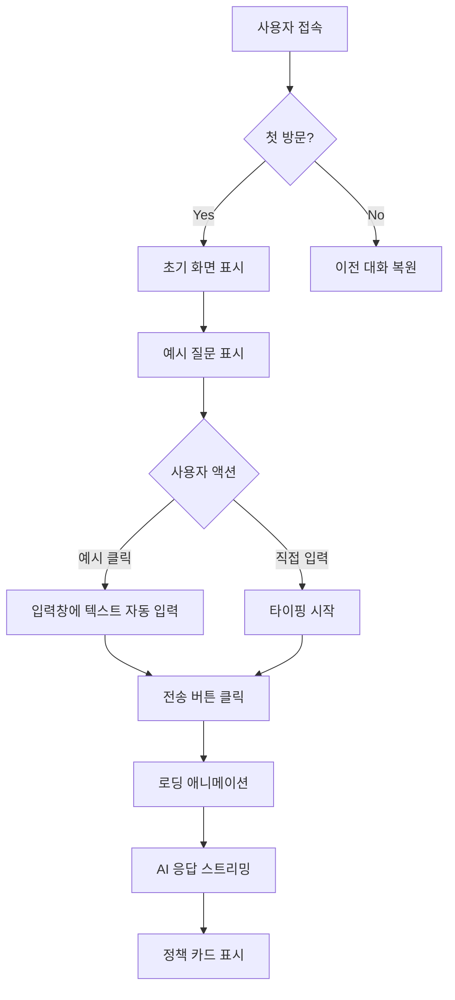
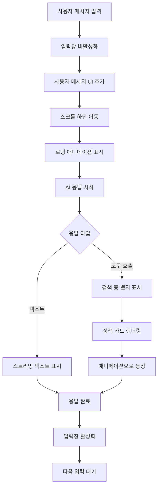
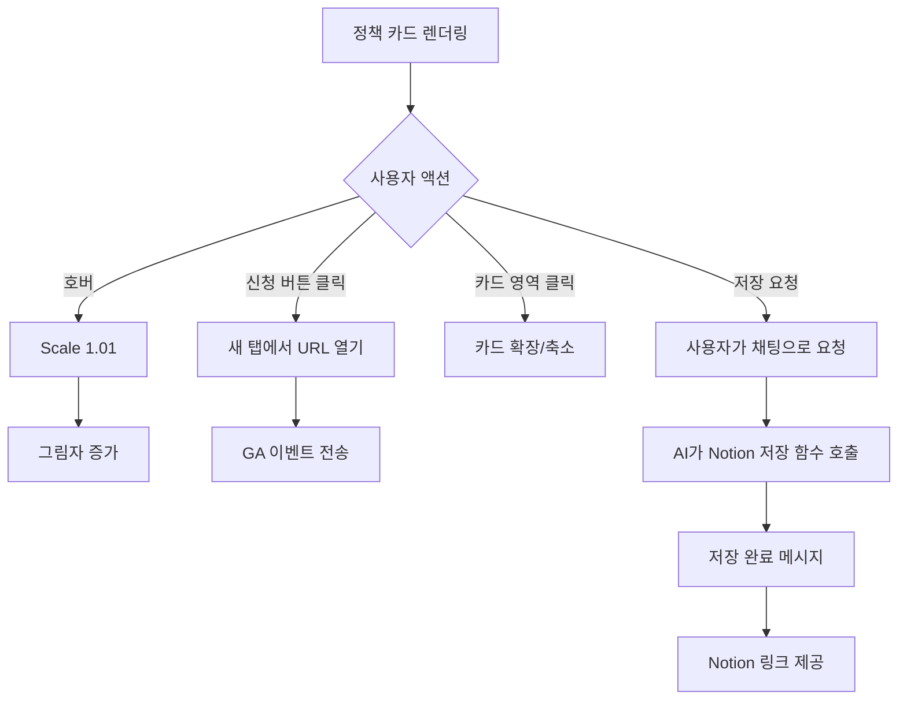
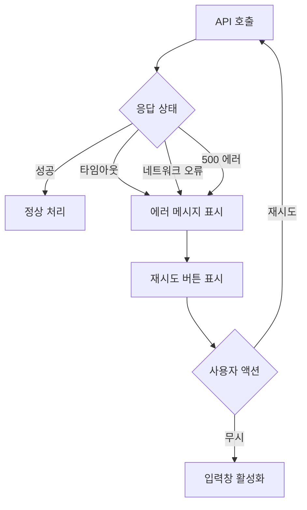

# 폴리 AI 와이어프레임 문서

> **버전**: 1.0  
> **작성일**: 2026년 1월  
> **담당**: UX/UI 디자인팀

---

## 📋 목차

1. [와이어프레임 개요](#1-와이어프레임-개요)
2. [화면 구조](#2-화면-구조)
3. [상세 와이어프레임](#3-상세-와이어프레임)
4. [반응형 디자인](#4-반응형-디자인)
5. [인터랙션 플로우](#5-인터랙션-플로우)
6. [컴포넌트 명세](#6-컴포넌트-명세)

---

## 1. 와이어프레임 개요

### 1.1 디자인 원칙

#### 대화형 우선 (Conversation-First)
- 채팅 인터페이스를 중심으로 모든 상호작용 설계
- 사용자가 자연스럽게 말하듯 정보를 입력하도록 유도

#### 즉각적 피드백 (Immediate Feedback)
- 사용자 입력 즉시 시각적 피드백 제공
- 로딩 상태, 타이핑 애니메이션 등으로 대기 시간 체감 최소화

#### 최소한의 인지 부담 (Minimal Cognitive Load)
- 한 화면에 하나의 주요 액션
- 예시 질문으로 사용자 학습 곡선 단축

#### 친근함과 신뢰성 균형 (Friendly & Trustworthy)
- 반말 톤으로 친근함 표현
- 공식 정보 출처 명시로 신뢰성 확보

### 1.2 화면 목록

| ID | 화면명 | 설명 |
|----|-------|------|
| WF-01 | 초기 화면 (Landing) | 첫 방문 시 표시되는 화면 |
| WF-02 | 대화 화면 (Chat) | 메인 대화 인터페이스 |
| WF-03 | 정책 카드 (Policy Card) | 정책 정보 표시 컴포넌트 |
| WF-04 | Notion 설정 (Settings) | Notion 연동 가이드 |
| WF-05 | 로딩 상태 (Loading) | AI 응답 대기 화면 |
| WF-06 | 에러 상태 (Error) | 오류 발생 시 화면 |

---

## 2. 화면 구조

### 2.1 전체 레이아웃

```
┌─────────────────────────────────────────┐
│  Header (고정)                           │
│  - 로고                                  │
│  - Notion 설정 버튼                      │
├─────────────────────────────────────────┤
│                                         │
│  Main Content (스크롤 가능)              │
│  - 초기 화면 또는 대화 내역               │
│                                         │
│                                         │
│                                         │
├─────────────────────────────────────────┤
│  Input Area (고정)                       │
│  - 입력창                                │
│  - 전송 버튼                             │
│  - 안내 문구                             │
└─────────────────────────────────────────┘
```

### 2.2 레이아웃 스펙

| 영역 | 높이 | 특징 |
|------|------|------|
| Header | 80px | 고정 (sticky) |
| Main Content | calc(100vh - 160px) | 스크롤 가능 |
| Input Area | 80px | 고정 (sticky) |

---

## 3. 상세 와이어프레임

### 3.1 WF-01: 초기 화면 (Landing)

```
┌──────────────────────────────────────────────────────────┐
│ Header                                                   │
│ ┌────────┐                          ┌──────────────┐    │
│ │ [로고] │ 폴리 AI                  │ 📚 Notion 설정│    │
│ └────────┘                          └──────────────┘    │
├──────────────────────────────────────────────────────────┤
│                                                          │
│                     ┌──────────┐                         │
│                     │          │                         │
│                     │  [아이콘] │                        │
│                     │          │                         │
│                     └──────────┘                         │
│                                                          │
│              안녕! 나는 폴리 AI야 👋                      │
│                                                          │
│          너에게 딱 맞는 청년 정책을 찾아줄게              │
│                                                          │
│     나이, 지역, 관심사를 말해주면 AI가 의미를 이해해서    │
│            가장 관련있는 정책을 추천해줄게!              │
│                                                          │
│  ┌──────────────────────┐  ┌──────────────────────┐     │
│  │ 서울에 사는 25살인데  │  │ 월세 지원 받을 수    │     │
│  │ 받을 수 있는 정책    │  │ 있는 정책 찾아줘     │     │
│  │ 알려줘               │  │                      │     │
│  └──────────────────────┘  └──────────────────────┘     │
│                                                          │
│  ┌──────────────────────┐  ┌──────────────────────┐     │
│  │ 알바 중인데 신청     │  │ 창업 지원금          │     │
│  │ 가능한 일자리 정책은?│  │ 받고 싶어            │     │
│  └──────────────────────┘  └──────────────────────┘     │
│                                                          │
├──────────────────────────────────────────────────────────┤
│ Input Area                                               │
│ ┌────────────────────────────────────────┐  ┌───────┐   │
│ │ 메시지를 입력하세요... 💬              │  │ [전송]│   │
│ └────────────────────────────────────────┘  └───────┘   │
│ 🤖 AI가 생성한 정보는 참고용입니다                       │
└──────────────────────────────────────────────────────────┘
```

#### 구성 요소

**1. 중앙 로고 및 인사말**
- 크기: 96x96px
- 애니메이션: Gradient pulse
- 위치: 수직 중앙 정렬

**2. 소개 텍스트**
- 타이포그래피: 
  - 인사말: 40px, Bold
  - 설명: 18px, Regular
  - 부연 설명: 14px, Medium

**3. 예시 질문 카드 (4개)**
- 레이아웃: 2x2 Grid
- 크기: 각 카드 280x100px
- 스타일: 흰색 배경, 둥근 모서리 (16px)
- 호버 효과: Scale 1.02, Shadow 증가

**4. 입력 영역**
- 너비: 최대 1000px (중앙 정렬)
- 입력창: 높이 56px, 둥근 모서리 16px
- 버튼: 56x56px, 그라데이션 배경

### 3.2 WF-02: 대화 화면 (Chat)

```
┌──────────────────────────────────────────────────────────┐
│ Header                                                   │
│ ┌────────┐                          ┌──────────────┐    │
│ │ [로고] │ 폴리 AI                  │ 📚 Notion 설정│    │
│ └────────┘                          └──────────────┘    │
├──────────────────────────────────────────────────────────┤
│ Main Content (스크롤)                                    │
│                                                          │
│  ┌─────────────────────────────────────────┐    ┌──┐   │
│  │ 서울에 사는 25살인데 받을 수 있는      │    │👤│   │
│  │ 정책 알려줘                             │    └──┘   │
│  └─────────────────────────────────────────┘            │
│                                                          │
│   ┌──┐    ┌────────────────────────────────────────┐   │
│   │🤖│    │ 오! 서울 거주 25살 청년이구나 👋      │   │
│   └──┘    │                                        │   │
│            │ 너에게 맞는 정책을 찾아봤어!           │   │
│            └────────────────────────────────────────┘   │
│                                                          │
│   ┌──┐    ┌────────────────────────────────────────┐   │
│   │🤖│    │ 🔍 3개의 정책을 찾았어! [RAG 🧠]       │   │
│   └──┘    └────────────────────────────────────────┘   │
│                                                          │
│            [정책 카드 1 - 자세한 내용은 WF-03 참조]      │
│            [정책 카드 2]                                 │
│            [정책 카드 3]                                 │
│                                                          │
│  ┌─────────────────────────────────────────┐    ┌──┐   │
│  │ 첫 번째 거 노션에 저장해줘              │    │👤│   │
│  └─────────────────────────────────────────┘    └──┘   │
│                                                          │
│   ┌──┐    ┌────────────────────────────────────────┐   │
│   │🤖│    │ ✅ Notion에 저장했어!                  │   │
│   └──┘    │ 📚 저장된 정책: 청년 월세 지원 사업    │   │
│            │ 🔗 [노션에서 보기]                     │   │
│            └────────────────────────────────────────┘   │
│                                                          │
├──────────────────────────────────────────────────────────┤
│ Input Area                                               │
│ ┌────────────────────────────────────────┐  ┌───────┐   │
│ │ 메시지를 입력하세요... 💬              │  │ [전송]│   │
│ └────────────────────────────────────────┘  └───────┘   │
│ 🤖 AI가 생성한 정보는 참고용입니다                       │
└──────────────────────────────────────────────────────────┘
```

#### 구성 요소

**1. 사용자 메시지**
- 정렬: 우측
- 배경: Indigo → Purple 그라데이션
- 텍스트 색상: 흰색
- 패딩: 16px 20px
- 최대 너비: 75%
- 아바타: 회색 배경, User 아이콘

**2. AI 메시지**
- 정렬: 좌측
- 배경: 흰색 (80% opacity, backdrop-blur)
- 텍스트 색상: 검정
- 패딩: 16px 20px
- 최대 너비: 75%
- 아바타: 그라데이션 배경, Bot 아이콘

**3. 도구 호출 결과 뱃지**
- 배경: Indigo-50 → Purple-50 그라데이션
- 텍스트: "🔍 3개의 정책을 찾았어!"
- RAG 뱃지: Purple-100 배경, "RAG 🧠"

**4. 메시지 애니메이션**
- 입장: fadeIn + slideUp (300ms)
- 타이밍: cubic-bezier(0.4, 0, 0.2, 1)

### 3.3 WF-03: 정책 카드 (Policy Card)

```
┌──────────────────────────────────────────────────────────┐
│ ┌────┐ ┌─────────┐ ┌─────────────┐                      │
│ │ 🏠 │ │  주거   │ │ 19-34세     │ 🎯 관련도 85%        │
│ └────┘ └─────────┘ └─────────────┘                      │
│                                                          │
│ 청년 월세 지원 사업                                      │
│ 만 19세~34세 청년의 월세 부담을 덜어드립니다             │
│                                                          │
│ ┌──────────────────────────────────────────────────┐   │
│ │ 💎 지원 혜택                                      │   │
│ │ 월 최대 20만원 지원 (최대 12개월)                │   │
│ └──────────────────────────────────────────────────┘   │
│                                                          │
│ 📅 신청 기간: 2026년 1월 ~ 12월                          │
│ 🏢 운영 기관: 서울시청 주택정책과                        │
│ 📍 지역: 서울                                           │
│                                                          │
│ ─────────────────────────────────────────────────────   │
│ 신청 자격                                               │
│ 중위소득 150% 이하, 무주택 가구원, 임차보증금 5천만원   │
│ 이하                                                    │
│                                                          │
│ ┌──────────────────────────────────────────────────┐   │
│ │          신청하러 가기 →                         │   │
│ └──────────────────────────────────────────────────┘   │
└──────────────────────────────────────────────────────────┘
```

#### 카드 스펙

**크기**
- 너비: 100% (최대 600px)
- 높이: auto (내용에 따라 가변)
- 패딩: 24px

**스타일**
- 배경: 흰색 (80% opacity)
- 테두리: 1px solid rgba(gray, 0.2)
- 둥근 모서리: 16px
- 그림자: 0 4px 6px rgba(0,0,0,0.1)
- 호버 그림자: 0 10px 25px rgba(0,0,0,0.15)

**헤더 영역**
- 카테고리 뱃지: 
  - 크기: 32x32px 아이콘 + 텍스트
  - 색상: 카테고리별 (주거=파랑, 일자리=초록, 창업=보라, 등)
- 연령 뱃지: 회색 배경, 12px 텍스트
- 관련도 뱃지: 초록 그라데이션, 볼드 텍스트

**본문 영역**
- 제목: 20px, Bold
- 요약: 14px, Regular, 회색
- 지원 혜택 박스: 그라데이션 배경, 16px 패딩

**메타 정보**
- 아이콘 + 텍스트 조합
- 아이콘: 16x16px
- 텍스트: 14px, Medium

**CTA 버튼**
- 너비: 100%
- 높이: 56px
- 배경: Indigo → Purple → Pink 그라데이션
- 텍스트: 16px, Bold, 흰색
- 호버 효과: Scale 1.02, 그림자 증가

### 3.4 WF-04: Notion 설정 안내

```
┌──────────────────────────────────────────────────────────┐
│ [파란색 배경 영역]                                       │
│                                                          │
│ 📚  📚 Notion 북마크 기능 설정하기                       │
│                                                          │
│     관심있는 정책을 Notion에 저장하려면 5분 설정이        │
│     필요해요!                                           │
│                                                          │
│     1. Notion Integration 만들기                        │
│     2. 데이터베이스 생성                                 │
│     3. 환경변수 설정                                     │
│                                                          │
│     📖 [자세한 가이드 보기]                             │
│                                              [닫기]      │
└──────────────────────────────────────────────────────────┘
```

#### 구성 요소

**배너 스타일**
- 배경: Blue-50
- 테두리: Blue-200
- 패딩: 16px 24px

**아이콘**
- 크기: 20x20px
- 색상: Blue-600

**텍스트**
- 제목: 16px, Bold, Blue-900
- 본문: 14px, Regular, Blue-800

**버튼**
- 가이드 버튼: Blue-600, 14px
- 닫기 버튼: 12px, Blue-600, Underline

### 3.5 WF-05: 로딩 상태

```
┌──────────────────────────────────────────────────────────┐
│                                                          │
│   ┌──┐    ┌────────────────────────────────────────┐   │
│   │🤖│    │ ● ● ●  (타이핑 애니메이션)            │   │
│   └──┘    └────────────────────────────────────────┘   │
│                                                          │
└──────────────────────────────────────────────────────────┘
```

#### 애니메이션 스펙

**타이핑 인디케이터**
- 3개의 점
- 크기: 10px (원)
- 색상: Indigo-400 → Purple-400 그라데이션
- 애니메이션: 순차적으로 Scale up/down (0.8 → 1.2)
- 주기: 1.4s infinite

**Spinner (대체 옵션)**
- 크기: 20x20px
- 색상: Purple-600
- 애니메이션: Rotate 360deg (1s linear infinite)

### 3.6 WF-06: 에러 상태

```
┌──────────────────────────────────────────────────────────┐
│                                                          │
│ ┌────────────────────────────────────────────────────┐  │
│ │ ⚠️ 오류가 발생했습니다                             │  │
│ │                                                    │  │
│ │ AI 응답 생성 중 문제가 발생했어요.                 │  │
│ │ 잠시 후 다시 시도해주세요.                         │  │
│ │                                                    │  │
│ │ 서버 로그를 확인하거나 페이지를 새로고침해주세요.   │  │
│ └────────────────────────────────────────────────────┘  │
│                                                          │
└──────────────────────────────────────────────────────────┘
```

#### 에러 카드 스펙

**스타일**
- 배경: Red-50 (80% opacity)
- 테두리: Red-200 (2px)
- 둥근 모서리: 16px
- 패딩: 24px

**텍스트**
- 제목: 18px, Bold, Red-800
- 본문: 14px, Medium, Red-600
- 안내: 12px, Regular, Red-500

---

## 4. 반응형 디자인

### 4.1 브레이크포인트

| 디바이스 | 너비 | 레이아웃 |
|---------|------|---------|
| Mobile | < 640px | 1열, 풀 너비 |
| Tablet | 640px - 1024px | 1열, 패딩 증가 |
| Desktop | > 1024px | 중앙 정렬, 최대 너비 1200px |

### 4.2 Mobile (< 640px)

```
┌─────────────────────┐
│ Header (60px)       │
│ [로고] 폴리 AI      │
├─────────────────────┤
│                     │
│   [아이콘]          │
│                     │
│ 안녕! 나는          │
│ 폴리 AI야 👋        │
│                     │
│ ┌─────────────────┐ │
│ │ 예시 질문 1     │ │
│ └─────────────────┘ │
│ ┌─────────────────┐ │
│ │ 예시 질문 2     │ │
│ └─────────────────┘ │
│                     │
├─────────────────────┤
│ [입력창]   [전송]   │
└─────────────────────┘
```

**변경 사항**:
- 헤더 높이: 80px → 60px
- 예시 질문: 2x2 → 1열 Stack
- 정책 카드: 풀 너비
- 패딩: 16px
- 아바타 크기: 40px → 32px

### 4.3 Tablet (640px - 1024px)

```
┌────────────────────────────────┐
│ Header (70px)                  │
│ [로고] 폴리 AI     [Notion]    │
├────────────────────────────────┤
│                                │
│        [아이콘]                │
│                                │
│  안녕! 나는 폴리 AI야 👋       │
│                                │
│ ┌──────────┐  ┌──────────┐    │
│ │예시 질문 1│  │예시 질문 2│    │
│ └──────────┘  └──────────┘    │
│ ┌──────────┐  ┌──────────┐    │
│ │예시 질문 3│  │예시 질문 4│    │
│ └──────────┘  └──────────┘    │
│                                │
├────────────────────────────────┤
│ [입력창]              [전송]   │
└────────────────────────────────┘
```

**변경 사항**:
- 헤더 높이: 80px → 70px
- 예시 질문: 2x2 Grid (유지)
- 패딩: 24px
- 최대 너비: 768px (중앙 정렬)

### 4.4 Desktop (> 1024px)

**기본 레이아웃 유지**
- 최대 너비: 1200px
- 중앙 정렬
- 패딩: 32px

---

## 5. 인터랙션 플로우

### 5.1 초기 진입 플로우



### 5.2 대화 진행 플로우



### 5.3 정책 카드 인터랙션



### 5.4 에러 핸들링 플로우



---

## 6. 컴포넌트 명세

### 6.1 Button 컴포넌트

#### 6.1.1 Primary Button

**용도**: 주요 액션 (전송, 신청하러 가기)

**스펙**:
```
배경: linear-gradient(Indigo-600 → Purple-600 → Pink-600)
텍스트: 흰색, 16px, Bold
높이: 56px
둥근 모서리: 16px
패딩: 0 24px
호버: 그라데이션 진해짐, Scale 1.05
클릭: Scale 0.98
비활성화: 회색 배경, opacity 0.5
```

#### 6.1.2 Secondary Button

**용도**: 부가 액션 (닫기, 취소)

**스펙**:
```
배경: 투명
테두리: 2px solid Indigo-600
텍스트: Indigo-600, 14px, Medium
높이: 40px
둥근 모서리: 12px
패딩: 0 16px
호버: 배경 Indigo-50
```

#### 6.1.3 Text Button

**용도**: 링크, 보조 액션

**스펙**:
```
배경: 없음
텍스트: Indigo-600, 14px, Medium, Underline
패딩: 4px 8px
호버: Indigo-700
```

### 6.2 Input 컴포넌트

#### 6.2.1 Text Input

**스펙**:
```
배경: 흰색 (80% opacity)
테두리: 2px solid Gray-200
둥근 모서리: 16px
높이: 56px
패딩: 0 20px
폰트: 15px, Regular
플레이스홀더: Gray-400

포커스:
  테두리: Purple-400
  그림자: 0 0 0 4px rgba(Purple-400, 0.1)
  
비활성화:
  배경: Gray-100
  커서: not-allowed
```

### 6.3 Badge 컴포넌트

#### 6.3.1 Category Badge

**카테고리별 색상**:
```
주거: Blue-100 배경, Blue-800 텍스트
일자리: Green-100 배경, Green-800 텍스트
창업: Purple-100 배경, Purple-800 텍스트
교육: Yellow-100 배경, Yellow-800 텍스트
자산형성: Pink-100 배경, Pink-800 텍스트
복지: Teal-100 배경, Teal-800 텍스트
문화: Orange-100 배경, Orange-800 텍스트
```

**스펙**:
```
폰트: 12px, Bold
패딩: 6px 12px
둥근 모서리: 12px
```

#### 6.3.2 Status Badge

**관련도 점수**:
```
배경: Green-100 → Emerald-100 그라데이션
텍스트: Green-700, 12px, Bold
테두리: Green-200 (1px)
패딩: 4px 10px
둥근 모서리: 10px
아이콘: 🎯
```

**RAG 뱃지**:
```
배경: Purple-100
텍스트: Purple-700, 12px, Bold
패딩: 4px 10px
둥근 모서리: 8px
아이콘: 🧠
```

### 6.4 Card 컴포넌트

#### 6.4.1 Policy Card

**스펙** (WF-03 참조):
```
배경: white
테두리: 1px solid rgba(0,0,0,0.05)
둥근 모서리: 16px
패딩: 24px
그림자: 0 4px 6px rgba(0,0,0,0.1)
호버 그림자: 0 10px 25px rgba(0,0,0,0.15)
호버 Scale: 1.01
트랜지션: all 300ms ease
```

#### 6.4.2 Message Card

**사용자 메시지**:
```
배경: linear-gradient(Indigo-600 → Purple-600)
텍스트: 흰색, 15px
패딩: 14px 20px
둥근 모서리: 16px (우상단 4px)
최대 너비: 75%
정렬: 우측
```

**AI 메시지**:
```
배경: white (80% opacity, backdrop-blur)
텍스트: Gray-900, 15px
패딩: 14px 20px
둥근 모서리: 16px (좌상단 4px)
테두리: 1px solid Gray-200
최대 너비: 75%
정렬: 좌측
```

### 6.5 Avatar 컴포넌트

#### 사용자 아바타

**스펙**:
```
크기: 40x40px
배경: Gray-400 → Gray-500 그라데이션
둥근 모서리: 16px
아이콘: User (Lucide), 20x20px, 흰색
```

#### AI 아바타

**스펙**:
```
크기: 40x40px
배경: Indigo-500 → Purple-500 → Pink-500 그라데이션
애니메이션: gradient-shift (무한 반복)
둥근 모서리: 16px
아이콘: Bot 또는 Sparkles (Lucide), 20x20px, 흰색
그림자: 0 4px 8px rgba(Purple-500, 0.3)
```

---

## 7. 애니메이션 명세

### 7.1 페이지 진입 애니메이션

```css
@keyframes fadeIn {
  from {
    opacity: 0;
    transform: translateY(20px);
  }
  to {
    opacity: 1;
    transform: translateY(0);
  }
}

.fade-in {
  animation: fadeIn 600ms cubic-bezier(0.4, 0, 0.2, 1);
}
```

### 7.2 메시지 등장 애니메이션

```css
@keyframes messageSlideUp {
  from {
    opacity: 0;
    transform: translateY(10px);
  }
  to {
    opacity: 1;
    transform: translateY(0);
  }
}

.message-animation {
  animation: messageSlideUp 300ms cubic-bezier(0.4, 0, 0.2, 1);
}
```

### 7.3 타이핑 인디케이터

```css
@keyframes typing {
  0%, 60%, 100% {
    transform: scale(0.8);
    opacity: 0.4;
  }
  30% {
    transform: scale(1.2);
    opacity: 1;
  }
}

.typing-dot:nth-child(1) {
  animation: typing 1.4s infinite;
}
.typing-dot:nth-child(2) {
  animation: typing 1.4s 0.2s infinite;
}
.typing-dot:nth-child(3) {
  animation: typing 1.4s 0.4s infinite;
}
```

### 7.4 그라데이션 애니메이션

```css
@keyframes gradient-shift {
  0%, 100% {
    background-position: 0% 50%;
  }
  50% {
    background-position: 100% 50%;
  }
}

.gradient-animate {
  background-size: 200% 200%;
  animation: gradient-shift 3s ease infinite;
}
```

### 7.5 호버 애니메이션

```css
.hover-card {
  transition: all 300ms cubic-bezier(0.4, 0, 0.2, 1);
}

.hover-card:hover {
  transform: scale(1.02);
  box-shadow: 0 20px 40px rgba(0, 0, 0, 0.15);
}
```

---

## 8. 접근성 (A11y)

### 8.1 키보드 내비게이션

- **Tab**: 다음 포커스 가능 요소로 이동
- **Shift + Tab**: 이전 포커스 가능 요소로 이동
- **Enter**: 버튼 클릭, 메시지 전송
- **Esc**: 모달/오버레이 닫기

### 8.2 스크린 리더 지원

**ARIA 레이블**:
```html
<button aria-label="메시지 전송">
  <Send />
</button>

<div role="region" aria-label="대화 내역">
  <!-- 메시지들 -->
</div>

<div role="status" aria-live="polite">
  <!-- AI 응답 스트리밍 -->
</div>
```

### 8.3 색상 대비

- **텍스트**: 최소 4.5:1 (WCAG AA)
- **큰 텍스트**: 최소 3:1
- **인터랙티브 요소**: 최소 3:1

### 8.4 포커스 표시

```css
*:focus-visible {
  outline: 3px solid rgba(139, 92, 246, 0.5);
  outline-offset: 2px;
}
```

---

## 9. 성능 최적화

### 9.1 이미지 최적화

- **로고/아이콘**: SVG 사용
- **아바타**: 40x40px WebP
- **Lazy Loading**: 정책 카드 이미지

### 9.2 애니메이션 최적화

- **GPU 가속**: `transform`, `opacity` 사용
- **will-change**: 애니메이션 요소에 적용
- **Debounce**: 스크롤, 리사이즈 이벤트

### 9.3 렌더링 최적화

- **Virtual Scrolling**: 메시지 100개 이상 시
- **React.memo**: 정책 카드 컴포넌트
- **useMemo**: 정책 필터링 결과

---

## 부록

### A. 디자인 토큰

```json
{
  "colors": {
    "primary": {
      "50": "#EEF2FF",
      "600": "#6366F1",
      "700": "#4F46E5"
    },
    "purple": {
      "500": "#8B5CF6",
      "600": "#7C3AED"
    },
    "pink": {
      "500": "#EC4899",
      "600": "#DB2777"
    }
  },
  "spacing": {
    "xs": "4px",
    "sm": "8px",
    "md": "16px",
    "lg": "24px",
    "xl": "32px"
  },
  "borderRadius": {
    "sm": "8px",
    "md": "12px",
    "lg": "16px",
    "xl": "24px"
  }
}
```

### B. 아이콘 목록

| 용도 | 아이콘 | 라이브러리 |
|-----|-------|-----------|
| 전송 | Send | Lucide React |
| 로딩 | Loader2 | Lucide React |
| AI | Sparkles | Lucide React |
| 사용자 | User | Lucide React |
| 봇 | Bot | Lucide React |
| 달력 | Calendar | Lucide React |
| 위치 | MapPin | Lucide React |
| 건물 | Building2 | Lucide React |
| 체크 | CheckCircle2 | Lucide React |
| 링크 | ExternalLink | Lucide React |
| Notion | BookMarked | Lucide React |

---

**문서 버전**: 1.0  
**최종 수정**: 2026년 1월  
**작성자**: UX/UI 디자인팀
